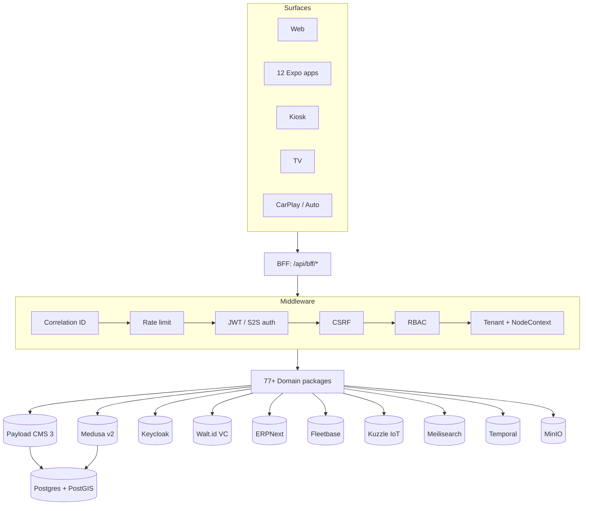

Dakkah CityOS is a **Capability-Driven Surface Runtime Architecture**: a Payload CMS \+ Next.js application that fronts 77\+ domain packages, mediates every request through a uniform BFF middleware pipeline, and renders surface-aware UIs via SDUI.

## The platform at a glance



## Layer reference

| Layer | Technology | Port |
| --- | --- | --- |
| CMS / App shell | Payload CMS 3 \+ Next.js 15 | 3000 |
| Commerce engine | Medusa v2 | 9000 |
| Identity provider | Keycloak | 8080 |
| Verifiable credentials | Walt.id | 7000 |
| ERP (T3–T5 tenants) | ERPNext | 8001 |
| Fleet & logistics | Fleetbase \+ FleetOps | 8000 / 5009 |
| IoT ingestion | Kuzzle Device Manager | 7512 |
| Search | Meilisearch | 7700 |
| Workflow orchestration | Temporal | 7233 |
| Object storage | MinIO | 9001 |
| Database | PostgreSQL 16 \+ PostGIS | 5432 |

## BFF middleware pipeline

Every `/api/bff/*` route is wrapped by `withBff()`, which runs:

1. **Correlation ID assignment** — returned in every response for tracing
2. **Rate limiting** — per-IP and per-token quotas
3. **JWT / S2S authentication** — Keycloak or Payload JWT, or `X-S2S-Key`
4. **CSRF double-submit cookie validation** (mutations only)
5. **RBAC role verification** when route declares required roles
6. **Tenant resolution \+ domain capability gating** — reads `x-tenant-slug` or origin
7. **NodeContext extraction and propagation** — spatial scope (Country → POI)

Mutation endpoints additionally accept `X-Idempotency-Key` for safe retries.

## Standard envelope

Every response shares the same envelope:

```json
{
  "success": true,
  "data": {},
  "meta": { "tenantSlug": "...", "timestamp": "..." },
  "pagination": { "page": 1, "limit": 20, "total": 156, "totalPages": 8 },
  "correlationId": "550e8400-e29b-41d4-a716-446655440000"
}
```

See [API conventions](/api/conventions) and [Error codes](/resources/error-codes).

## Domain packages

CityOS ships **77\+ domain packages**. Each is a self-contained TypeScript library with its own collections, SDUI blocks, React hooks, and BFF routes. See [Domains](/concepts/domains) for the full list.

## Surfaces

The SDK enumerates 8 canonical surfaces (`mobile`, `mobile_large`, `tablet`, `desktop`, `desktop_wide`, `kiosk`, `tv_1080p`, `carplay`). Mobile apps span 12 Expo targets across iOS, Android, watchOS, tvOS, and Android Automotive. See [Surfaces](/concepts/surfaces) and [Apps](/apps/overview).

## Multi-tenancy

5 ownership tiers (`MASTER` → `GLOBAL` → `REGIONAL` → `COUNTRY` → `CITY`) plus a 10-level spatial node tree (Country → … → POI). ERPNext backs T1–T3; Tryton backs T4–T5. See [Multi-tenancy](/concepts/multi-tenancy).

## Realtime

Live data — IoT readings, fleet positions, booking status — streams over Ably with tenant-scoped channels. See [Realtime integration](/integrations/realtime).

## Related

- [Data model](/concepts/data-model)
- [Deployment](/configuration/deployment)
- [Environment variables](/configuration/environment-variables)