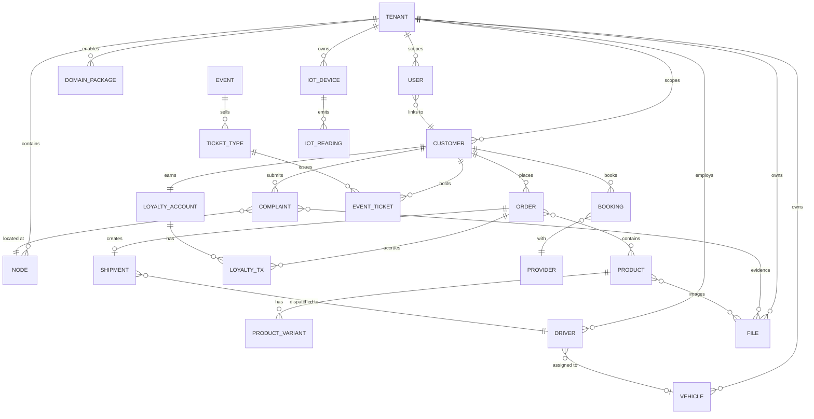

This page is the canonical map of how CityOS entities relate to each other. Use it when you need to reason across verticals — for example, when wiring loyalty into commerce, or when modelling a webhook handler that touches both bookings and citizen complaints.

## Top-level diagram



## Entity reference

### Tenancy

| Entity | Notes |
| --- | --- |
| `TENANT` | Root namespace. Tier: `MASTER` → `GLOBAL` → `REGIONAL` → `COUNTRY` → `CITY`. |
| `NODE` | Spatial unit: Country → Region → District → Zone → Sector → Facility → Building → Floor → Unit → POI. |
| `DOMAIN_PACKAGE` | One of 77\+ packages enabled per tenant via capability flags. |

### Identity

| Entity | Notes |
| --- | --- |
| `USER` | Payload CMS user record. Carries roles, tenant binding, optional `keycloakSub`. |
| `CUSTOMER` | Medusa customer record. Linked 1–1 to a `USER` for citizens; standalone for guests. |

### Commerce

| Entity | Notes |
| --- | --- |
| `PRODUCT` | Medusa product with one of 12 archetypes. |
| `PRODUCT_VARIANT` | SKU-level inventory unit. |
| `CART` | Transient pre-order state. Manipulated via the cart action endpoint. |
| `ORDER` | Completed cart. Ownership-enforced. |

### Bookings

| Entity | Notes |
| --- | --- |
| `BOOKING` | Time-slotted reservation. Status: `pending` → `confirmed` → `in_progress` → `completed` (or `cancelled` / `no_show`). |
| `PROVIDER` | Service performer (clinic, salon, mechanic). |

### Citizen

| Entity | Notes |
| --- | --- |
| `COMPLAINT` | Categorised civic issue. Carries `referenceNumber` like `CMP-2026-00789`. |
| `PERMIT` | Regulator-issued document. Lifecycle: `draft` → `submitted` → `approved` → `active` → `expired`/`revoked`. |

### Events & loyalty

| Entity | Notes |
| --- | --- |
| `EVENT` | Time-bounded venue activity. |
| `TICKET_TYPE` | Price tier (e.g. general admission). |
| `EVENT_TICKET` | Per-customer entitlement with signed QR. |
| `LOYALTY_ACCOUNT` | Per-customer points balance & tier. |
| `LOYALTY_TX` | Single accrual / redemption / adjustment entry. |

### Fleet

| Entity | Notes |
| --- | --- |
| `VEHICLE` | Fleet asset. |
| `DRIVER` | Linked to a Keycloak identity. |
| `SHIPMENT` | Pickup \+ dropoff with SLA window. |

### IoT

| Entity | Notes |
| --- | --- |
| `IOT_DEVICE` | One of 8 sensor families. |
| `IOT_READING` | Decoded measurement at a timestamp. Stored in the time-series store. |

### Storage

| Entity | Notes |
| --- | --- |
| `FILE` | Object in MinIO/S3, prefixed by tenant slug. Referenced by complaints (evidence) and products (images). |

## Identity propagation

A single citizen typically has:

```text
USER (Payload)
  ├─ roles: ["citizen", "verified_citizen"]
  ├─ tenant: "riyadh-downtown"
  └─ keycloakSub: "kc-sub-456"

CUSTOMER (Medusa)
  ├─ id: "cust_01H…"
  └─ email: "citizen@example.com"
```

`GET /api/bff/auth/session` returns both, joined by the BFF.

## Cross-vertical flows

These flows reuse multiple entities at once. Use them as a sanity check when designing new features.

### Order to loyalty

```text
ORDER.paid (webhook)
  → LOYALTY_TX (type: accrue)
  → LOYALTY_ACCOUNT.pointsBalance updated
```

### Order to shipment

```text
ORDER.created
  → SHIPMENT.created
  → SHIPMENT.dispatched (driver assigned)
  → SHIPMENT.delivered (proof of delivery)
```

### Booking to file

```text
BOOKING.create
  → (optional) FILE.metadata captured pre-booking
  → BOOKING.completed
  → LOYALTY_TX (type: accrue) at 50 points
```

### Complaint to file

```text
FILE.uploaded (via signed URL)
  → COMPLAINT.create with evidenceUrls
  → COMPLAINT.in-progress
  → COMPLAINT.resolved
```

## Related

- [Architecture](/architecture)
- [Multi-tenancy](/concepts/multi-tenancy)
- [Domains](/concepts/domains) — the 77\+ domain packages
- [Domain schemas](/sdk/types/domain-schemas)