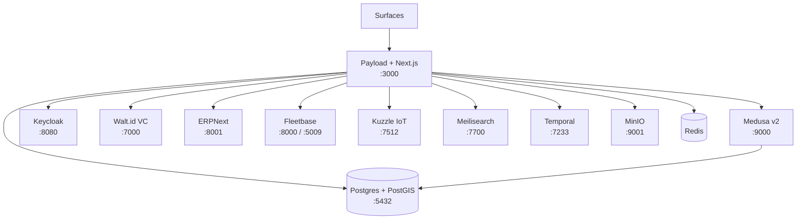

CityOS is a monorepo of services orchestrated by Docker Compose in local and reference deployments. This page documents the canonical layout, ports, Dockerfiles, and the three supported run modes.

## Reference topology



## Service port table

| Service | Tech | Port |
| --- | --- | --- |
| CMS / App shell | Payload CMS 3 \+ Next.js 15 | 3000 |
| Commerce engine | Medusa v2 | 9000 |
| Identity provider | Keycloak | 8080 |
| Verifiable credentials | Walt.id | 7000 |
| ERP (T1–T3 tenants) | ERPNext | 8001 |
| Fleet management | Fleetbase | 8000 |
| FleetOps | FleetOps | 5009 |
| IoT ingestion | Kuzzle Device Manager | 7512 |
| Search | Meilisearch | 7700 |
| Workflow orchestration | Temporal | 7233 |
| Object storage | MinIO | 9001 |
| Database | PostgreSQL 16 \+ PostGIS | 5432 |
| Cache | Redis | 6379 |

## Prerequisites

- Node.js 20\+
- pnpm 9\+
- PostgreSQL 16\+ with PostGIS
- Docker (for full-stack deploys)

## Run modes

### 1. Local dev (CMS only)

Fastest path. Runs Payload \+ Next.js against an existing Postgres.

```bash
pnpm install
cp .env.example .env
bash scripts/validate/validate-env.sh
pnpm dev
```

Admin at `http://localhost:3000/admin`.

### 2. Full stack (Docker)

Brings up Postgres, Redis, Meilisearch, MinIO, Temporal, Keycloak, Medusa, the CMS, and any selected profiles:

```bash
docker compose -f docker-compose.full.yml --profile all up -d
```

Pick narrower profiles for a subset:

```bash
docker compose -f docker-compose.full.yml --profile core --profile commerce up -d
```

### 3. Citus (sharded Postgres)

Starts a Citus coordinator \+ worker with a CMS wired to the coordinator:

```bash
docker compose -f docker-compose.full.yml --profile citus up -d
```

<Warning>
  Do **not** run the `core` and `citus` profiles together — both bind Postgres on `:5432` and the CMS on `:3000`.
</Warning>

## GitHub Codespaces

The repo ships a devcontainer with grouped VS Code tasks. Bootstrap with:

```bash
pnpm codespaces:doctor
pnpm codespaces:catalog
```

App catalog: `config/codespaces/apps.json`. Tasks: `.vscode/tasks.json` (groups for Core CMS, Web Surfaces, Commerce Stack, Identity and Workflows, IoT and Realtime).

## Dockerfiles

The repo provides per-service Dockerfiles for production builds:

| Service | Dockerfile |
| --- | --- |
| CMS / Next.js | `Dockerfile` |
| BFF | `Dockerfile.bff` |
| BFF Gateway | `Dockerfile.bff-gateway` |
| Medusa | `Dockerfile.medusa` |
| Storefront (Vite) | `Dockerfile.storefront` |
| Vite | `Dockerfile.vite` |
| Webapp | `Dockerfile.webapp` |
| Ops | `Dockerfile.ops` |
| Node worker | `Dockerfile.node` |

Each has a matching `.dockerignore`.

## Mobile builds (EAS)

12 Expo apps build through EAS. Required GitHub repo configuration:

- Secret: `EXPO_TOKEN`
- Variables: `EXPO_PUBLIC_BFF_URL`, `EXPO_PUBLIC_SENTRY_DSN`, `EXPO_PUBLIC_ABLY_KEY`, `EXPO_PUBLIC_MAPBOX_TOKEN`, `EXPO_PUBLIC_MEDUSA_BACKEND_URL`, `EXPO_PUBLIC_FLEETBASE_KEY`, `EXPO_PUBLIC_MOYASAR_KEY`, `EXPO_PUBLIC_STRIPE_KEY`

Workflows:

- `.github/workflows/mobile-build.yml` — EAS builds
- `.github/workflows/mobile-ota-update.yml` — OTA updates

## CI gates

| Workflow | Purpose |
| --- | --- |
| `security-scan.yml` | SAST \+ secret scanning on every PR |
| `mobile-build.yml` | EAS builds for 12 apps |
| `mobile-ota-update.yml` | Over-the-air bundle updates |
| `load-test.yml` | k6 performance gates on merge to main |

Coverage thresholds: **70% lines, 70% functions, 60% branches**.

## Critical environment variables

| Variable | Purpose |
| --- | --- |
| `DATABASE_URL` | Postgres connection string |
| `PAYLOAD_SECRET` | Payload CMS JWT secret (32\+ chars) |
| `MEDUSA_JWT_SECRET` | Medusa auth token secret |
| `KEYCLOAK_CLIENT_SECRET` | OIDC client secret |
| `S2S_SECRET` | Machine-to-machine internal auth key |
| `MEILISEARCH_API_KEY` | Meilisearch master key |
| `EXPO_TOKEN` | EAS builds |

Full list in [Environment variables](/configuration/environment-variables). Validate with `bash scripts/validate/validate-env.sh`.

## Health endpoints

| Service | Endpoint |
| --- | --- |
| CMS / BFF | `/api/bff/tenant/health` |
| Search | `/api/bff/search/health` |
| Medusa | `:9000/health` |
| Keycloak | `:8080/health/ready` |
| Temporal | `:7233` (gRPC health) |

## Post-deploy smoke test

1. `GET /api/bff/tenant/health` returns `200`
2. `GET /api/bff/tenant/capabilities` returns expected flags
3. `GET /api/bff/search/health` returns `available`
4. `POST /api/bff/auth/login` with seeded credentials returns `200` \+ cookie
5. `GET /api/bff/commerce/products` returns paginated catalog

## Related

- [Environment variables](/configuration/environment-variables)
- [Tenant setup](/configuration/tenant-setup)
- [Feature flags](/configuration/feature-flags)
- [Architecture](/architecture)