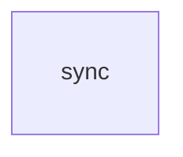

> **Type:** CityOS Core Infrastructure | **Framework:** Vitest | **Version:** 0.1.0
> **Path:** `packages/cityos-workflows-sdk` | **LOC:** 4,600 lines across 19 files

[Back to Generated Packages](/generated/packages)
## Overview & Design Philosophy

**Health Snapshot**

| Metric | Value | Status |
|---|---|---|
| Source Files | 19 | — |
| Lines of Code | 4,600 | — |
| Test Coverage | 36.8% | 🟡 |
| Oversized Files | 4 | 🟡 |
| Components | 0 | — |
| Hooks | 0 | — |
| Blocks | 0 | — |
| Collections | 1 | — |
| Types & Interfaces | 41 | — |
| Internal Deps | 0 | — |
| Dependents | 0 | 🟢 Low impact |

### ⚠️ Oversized Files

| File | Lines |
|---|---|
| packages/cityos-workflows-sdk/src/poiWorkflowDefinitions.ts | 1866 |
| packages/cityos-workflows-sdk/src/syncService.ts | 734 |
| packages/cityos-workflows-sdk/src/sagaExecutor.ts | 447 |
| packages/cityos-workflows-sdk/src/registry.ts | 431 |

## Architecture

### File Structure

```
classificationGuard.test.ts (72L, 0C, 0T)
classificationGuard.ts (85L, 0C, 3T)
client.ts (293L, 0C, 0T)
env.ts (24L, 0C, 0T)
errorUtils.test.ts (19L, 0C, 0T)
errorUtils.ts (5L, 0C, 0T)
governanceValidator.ts (65L, 0C, 2T)
index-contract.test.ts (24L, 0C, 0T)
index.ts (14L, 0C, 0T)
personaWorkflowGuard.ts (78L, 0C, 3T)
poiWorkflowDefinitions.ts (1866L, 0C, 6T)
registry.ts (431L, 0C, 2T)
residencyEnforcement.test.ts (61L, 0C, 0T)
residencyEnforcement.ts (155L, 0C, 3T)
sagaExecutor.ts (447L, 0C, 9T)
syncEngine.ts (153L, 0C, 3T)
syncService.ts (734L, 0C, 6T)
types.ts (11L, 0C, 1T)
workflowAccessControl.ts (63L, 0C, 3T)
```

## Public API Surface

### Components (12)

| Name | Kind | File |
|---|---|---|
| CLASSIFICATION_LEVELS | const | classificationGuard.ts |
| ROLE_MAX_CLASSIFICATION | const | classificationGuard.ts |
| COMMERCE_DATA_CLASSIFICATION | const | classificationGuard.ts |
| WORKFLOW_DATA_CLASSIFICATION | const | classificationGuard.ts |
| POI_WORKFLOW_DEFINITIONS | const | poiWorkflowDefinitions.ts |
| POI_TASK_QUEUES | const | poiWorkflowDefinitions.ts |
| POI_EVENT_BRIDGE_MAPPINGS | const | poiWorkflowDefinitions.ts |
| POI_SCHEDULE_TRIGGERS | const | poiWorkflowDefinitions.ts |
| POI_SIGNAL_DEFINITIONS | const | poiWorkflowDefinitions.ts |
| POI_QUERY_DEFINITIONS | const | poiWorkflowDefinitions.ts |
| RESIDENCY_RULES | const | residencyEnforcement.ts |
| WORKFLOW_OPERATION_MIN_ROLE | const | workflowAccessControl.ts |

### Functions (45)

| Name | Kind | File |
|---|---|---|
| checkClassification | function | classificationGuard.ts |
| getCommerceDataClassification | function | classificationGuard.ts |
| getWorkflowDataClassification | function | classificationGuard.ts |
| getTemporalConfig | function | client.ts |
| getTemporalClient | function | client.ts |
| checkTemporalHealth | function | client.ts |
| startWorkflow | function | client.ts |
| getWorkflowStatus | function | client.ts |
| closeTemporalConnection | function | client.ts |
| toErrMsg | function | errorUtils.ts |
| validateGovernanceForWorkflow | function | governanceValidator.ts |
| checkPersonaWorkflowAccess | function | personaWorkflowGuard.ts |
| clearWorkflowRegistryCache | function | registry.ts |
| getWorkflowDefinition | function | registry.ts |
| listActiveWorkflows | function | registry.ts |
| listWorkflowsByDomain | function | registry.ts |
| listWorkflowsBySource | function | registry.ts |
| getRegistryStats | function | registry.ts |
| registerWorkflow | function | registry.ts |
| removeWorkflow | function | registry.ts |
| ... | | | (25 more) |

### Types (37)

| Name | Kind | File |
|---|---|---|
| ClassificationContext | interface | classificationGuard.ts |
| ClassificationResult | interface | classificationGuard.ts |
| DataClassificationLevel | type | classificationGuard.ts |
| GovernanceValidationContext | interface | governanceValidator.ts |
| GovernanceValidationResult | interface | governanceValidator.ts |
| PersonaWorkflowConstraints | interface | personaWorkflowGuard.ts |
| PersonaContext | interface | personaWorkflowGuard.ts |
| PersonaWorkflowResult | interface | personaWorkflowGuard.ts |
| POIWorkflowDefinition | interface | poiWorkflowDefinitions.ts |
| POITaskQueueDefinition | interface | poiWorkflowDefinitions.ts |
| POIEventBridgeMapping | interface | poiWorkflowDefinitions.ts |
| POIScheduleTrigger | interface | poiWorkflowDefinitions.ts |
| POISignalDefinition | interface | poiWorkflowDefinitions.ts |
| POIQueryDefinition | interface | poiWorkflowDefinitions.ts |
| WorkflowDefinition | interface | registry.ts |
| WorkflowResolution | interface | registry.ts |
| ResidencyRule | interface | residencyEnforcement.ts |
| ResidencyCheckResult | interface | residencyEnforcement.ts |
| ResidencyZone | type | residencyEnforcement.ts |
| SagaStep | interface | sagaExecutor.ts |
| ... | | | (17 more) |

### Constants (1)

| Name | Kind | File |
|---|---|---|
| cityosWorkflowsEnv | const | env.ts |

## Type System

### ClassificationContext

**Kind:** interface | **File:** `classificationGuard.ts`

| Property | Type | Optional |
|---|---|---|
| userRole | `string` | — |
| dataClassification | `DataClassificationLevel` | — |
| operation | `string` | — |
| resourceId | `string` | Yes |

### ClassificationResult

**Kind:** interface | **File:** `classificationGuard.ts`

| Property | Type | Optional |
|---|---|---|
| allowed | `boolean` | — |
| reason | `string` | Yes |
| userMaxLevel | `DataClassificationLevel` | — |
| dataLevel | `DataClassificationLevel` | — |

### DataClassificationLevel

**Kind:** type | **File:** `classificationGuard.ts`

```ts
type DataClassificationLevel = 'PUBLIC' | 'INTERNAL' | 'CONFIDENTIAL' | 'RESTRICTED';
```

### GovernanceValidationContext

**Kind:** interface | **File:** `governanceValidator.ts`

| Property | Type | Optional |
|---|---|---|
| workflow | `WorkflowContext` | — |
| workflowType | `string` | — |
| dataClassification | `string` | Yes |
| residencyZone | `string` | Yes |
| userRole | `string` | — |

### GovernanceValidationResult

**Kind:** interface | **File:** `governanceValidator.ts`

| Property | Type | Optional |
|---|---|---|
| allowed | `boolean` | — |
| reason | `string` | Yes |
| appliedPolicies | `string[]` | — |
| residencyCheck | `{ passed: boolean; zone?: string; restriction?: string }` | Yes |
| classificationCheck | `{ passed: boolean; level?: string }` | Yes |

### PersonaWorkflowConstraints

**Kind:** interface | **File:** `personaWorkflowGuard.ts`

| Property | Type | Optional |
|---|---|---|
| allowedWorkflows | `string[]` | Yes |
| allowedTools | `string[]` | Yes |
| readOnly | `boolean` | Yes |
| geoScope | `string` | Yes |
| maxDataClassification | `string` | Yes |

### PersonaContext

**Kind:** interface | **File:** `personaWorkflowGuard.ts`

| Property | Type | Optional |
|---|---|---|
| personaId | `string` | Yes |
| axes | `{
    audience?: string;
    economic?: string;
    ecosystem?: string;
    government?: string;
    interaction?: string;
    aiMode?: string;
  }` | Yes |
| constraints | `PersonaWorkflowConstraints` | Yes |

### PersonaWorkflowResult

**Kind:** interface | **File:** `personaWorkflowGuard.ts`

| Property | Type | Optional |
|---|---|---|
| allowed | `boolean` | — |
| reason | `string` | Yes |
| constraint | `string` | Yes |

### POIWorkflowDefinition

**Kind:** interface | **File:** `poiWorkflowDefinitions.ts`

| Property | Type | Optional |
|---|---|---|
| workflowId | `string` | — |
| name | `string` | — |
| domainPack | `'poi'` | — |
| taskQueue | `string` | — |
| category | `string` | — |
| timeouts | `{ startToClose: string; scheduleToClose: string; heartbeat: string }` | — |
| retryPolicy | `{ maxRetries: number; initialInterval: string; backoffCoefficient: number; maxInterval: string }` | — |
| signals | `Array<{ name: string; schema: Record<string, string> }>` | — |
| queries | `Array<{ name: string; schema: Record<string, string> }>` | — |
| requiredCapabilities | `string[]` | — |
| crossSystemDependencies | `string[]` | — |
| tags | `string[]` | — |
| metadata | `{ description: string; wfCode?: string }` | — |
| sourceSystem | `string` | — |
| contractVersion | `string` | — |
| isActive | `boolean` | — |
| source | `'seeded'` | — |

### POITaskQueueDefinition

**Kind:** interface | **File:** `poiWorkflowDefinitions.ts`

| Property | Type | Optional |
|---|---|---|
| name | `string` | — |
| domainPack | `'poi'` | — |
| sourceSystem | `string` | — |
| description | `string` | — |

### POIEventBridgeMapping

**Kind:** interface | **File:** `poiWorkflowDefinitions.ts`

| Property | Type | Optional |
|---|---|---|
| eventType | `string` | — |
| workflowId | `string` | — |
| taskQueue | `string` | — |
| triggerType | `'event' | 'cms-webhook'` | — |
| description | `string` | — |

### POIScheduleTrigger

**Kind:** interface | **File:** `poiWorkflowDefinitions.ts`

| Property | Type | Optional |
|---|---|---|
| cron | `string` | — |
| workflowId | `string` | — |
| taskQueue | `string` | — |
| description | `string` | — |

### POISignalDefinition

**Kind:** interface | **File:** `poiWorkflowDefinitions.ts`

| Property | Type | Optional |
|---|---|---|
| name | `string` | — |
| schema | `Record<string, string>` | — |
| usedBy | `string[]` | — |

### POIQueryDefinition

**Kind:** interface | **File:** `poiWorkflowDefinitions.ts`

| Property | Type | Optional |
|---|---|---|
| name | `string` | — |
| schema | `Record<string, string>` | — |
| usedBy | `string[]` | — |

### WorkflowDefinition

**Kind:** interface | **File:** `registry.ts`

| Property | Type | Optional |
|---|---|---|
| workflowId | `string` | — |
| name | `string` | — |
| domainPack | `string` | — |
| taskQueue | `string` | — |
| isActive | `boolean` | — |
| contractVersion | `string` | Yes |
| retryPolicy | `{
    maxRetries?: number;
    initialInterval?: string;
    backoffCoefficient?: number;
    maxInterval?: string;
  }` | Yes |
| timeouts | `{
    startToClose?: string;
    scheduleToClose?: string;
    heartbeat?: string;
  }` | Yes |
| requiredCapabilities | `string[]` | Yes |
| requiredPolicies | `string[]` | Yes |
| signals | `unknown` | Yes |
| queries | `unknown` | Yes |
| inputSchema | `unknown` | Yes |
| outputSchema | `unknown` | Yes |
| metadata | `Record<string, unknown>` | Yes |
| sourceSystem | `string` | Yes |
| source | `'seeded' | 'discovered' | 'registered'` | Yes |
| temporalWorkflowType | `string` | Yes |
| taskQueues | `string[]` | Yes |

### WorkflowResolution

**Kind:** interface | **File:** `registry.ts`

| Property | Type | Optional |
|---|---|---|
| workflowName | `string` | — |
| taskQueue | `string` | — |
| definition | `WorkflowDefinition` | Yes |
| resolved | `boolean` | — |

### ResidencyRule

**Kind:** interface | **File:** `residencyEnforcement.ts`

| Property | Type | Optional |
|---|---|---|
| zone | `ResidencyZone` | — |
| restrictions | `string[]` | — |
| allowedDestinations | `ResidencyZone[]` | — |
| piiTransferAllowed | `boolean` | — |
| paymentDataTransferAllowed | `boolean` | — |
| dataRetentionDays | `number` | — |
| regulations | `string[]` | — |

### ResidencyCheckResult

**Kind:** interface | **File:** `residencyEnforcement.ts`

| Property | Type | Optional |
|---|---|---|
| allowed | `boolean` | — |
| reason | `string` | Yes |
| sourceZone | `ResidencyZone` | — |
| destinationZone | `ResidencyZone` | Yes |
| appliedRules | `string[]` | — |
| regulations | `string[]` | — |

### ResidencyZone

**Kind:** type | **File:** `residencyEnforcement.ts`

```ts
type ResidencyZone = 'GCC' | 'EU' | 'MENA' | 'APAC' | 'AMERICAS' | 'GLOBAL';
```

### SagaStep

**Kind:** interface | **File:** `sagaExecutor.ts`

| Property | Type | Optional |
|---|---|---|
| name | `string` | — |
| system | `string` | — |
| action | `string` | — |
| payload | `unknown` | — |
| status | `SagaStepStatus` | — |
| startedAt | `string` | Yes |
| completedAt | `string` | Yes |
| error | `string` | Yes |
| result | `unknown` | Yes |
| compensationAction | `string` | Yes |

*... and 21 more types*

## Payload Collections

### sync

**Slug:** `sync` | **File:** `syncEngine.ts` | **Fields:** 0

## Data Model

### Entity Relationship Diagram



## Diagrams

| Diagram | Source |
|---|---|
| Class Diagram | [cityos-workflows-sdk.mmd](/generated/diagrams/class/cityos-workflows-sdk.mmd) |
| Entity Relationship | [cityos-workflows-sdk.mmd](/generated/diagrams/er/cityos-workflows-sdk.mmd) |
| Dependency Graph | [cityos-workflows-sdk-dependencies.mmd](#) |

## Tests

- `classificationGuard.test.ts` (72 lines)
- `errorUtils.test.ts` (19 lines)
- `index-contract.test.ts` (24 lines)
- `residencyEnforcement.test.ts` (61 lines)

---
*Generated by scripts/docs/generators/deep/package-deep-dive.mjs*
