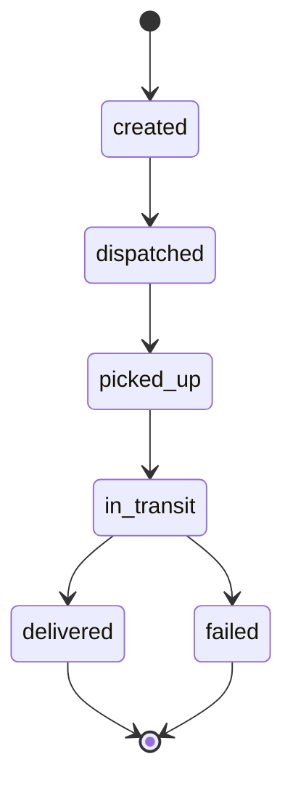

This guide walks through building a fleet experience on CityOS — from listing vehicles and dispatching shipments to streaming live driver positions and reacting to SLA breaches. Fleet operations are backed by **Fleetbase \+ FleetOps** (ports 8000 / 5009) and the `fleet-logistics` domain package.

## What you'll build

By the end of this guide you'll have:

- An authenticated CityOS client wired to the fleet domain
- A way to list vehicles and drivers for the active tenant
- A shipment creation \+ dispatch flow
- A live position subscription over Ably
- SLA-breach webhook handling

## Prerequisites

- An authenticated `CityOSClient` (see [Quickstart](/quickstart))
- The tenant must have `fleetEnabled: true` in capabilities
- `EXPO_PUBLIC_FLEETBASE_KEY` configured for native apps that talk to Fleetbase directly

```typescript
import { CityOSClient, createBffClients } from "@cityos/api-client";

const cityos = new CityOSClient({
  baseUrl: process.env.EXPO_PUBLIC_BFF_URL!,
  tenantId: "riyadh-downtown",
  surface: "mobile",
  getToken: async () => tokenStore.get(),
});

const { fleet, tenant } = createBffClients(cityos);

const { data: caps } = await tenant.getCapabilities();
if (!caps.fleetEnabled) throw new Error("Fleet is not enabled for this tenant");
```

## 1. List vehicles

```bash cURL
curl "https://cityos.dakkah.city/api/bff/fleet/vehicles?page=1&limit=20" \
  -H "Authorization: Bearer <token>" \
  -H "x-tenant-slug: riyadh-downtown"
```

```typescript TypeScript
const { data, pagination } = await fleet.listVehicles({ page: 1, limit: 20 });

data.forEach((v) => {
  console.log(v.id, v.licensePlate, v.status, v.assignedDriverId);
});
```

Vehicle shape:

| Field | Type | Notes |
| --- | --- | --- |
| `id` | string | Fleetbase ID |
| `licensePlate` | string | — |
| `model` | string | e.g. "Toyota Hiace" |
| `status` | enum | `available`, `dispatched`, `in_service`, `offline` |
| `assignedDriverId` | string \| null | Keycloak subject |
| `lastKnownPosition` | `{ lat, lng, timestamp }` | Cached snapshot |

## 2. Create and dispatch a shipment

A shipment has a pickup, a dropoff, and an SLA window. The BFF creates it in Fleetbase, then dispatches it to the optimal driver:

```typescript
const { data: shipment } = await fleet.createShipment({
  pickup: {
    address: "King Fahd Road, Riyadh",
    lat: 24.7136,
    lng: 46.6753,
    contactName: "Ahmed Al-Qahtani",
    contactPhone: "+966501234567",
  },
  dropoff: {
    address: "Olaya St, Riyadh",
    lat: 24.6913,
    lng: 46.6857,
    contactName: "Sara Al-Otaibi",
    contactPhone: "+966507654321",
  },
  sla: {
    pickupBy: "2026-06-01T10:00:00Z",
    deliverBy: "2026-06-01T11:00:00Z",
  },
  metadata: { orderId: "order_01H..." },
}, { idempotencyKey: `ship_${crypto.randomUUID()}` });

console.log(shipment.id, shipment.status); // "created"

await fleet.dispatchShipment(shipment.id);
// status → "dispatched"
```

<Note>
  Pass an `idempotencyKey` on every mutation. The server uses `X-Idempotency-Key` to deduplicate retries.
</Note>

## 3. Subscribe to live driver positions

Fleet positions stream over Ably. Authenticate via the BFF token endpoint:

```typescript
import Ably from "ably";

const ably = new Ably.Realtime({
  authUrl: `${process.env.EXPO_PUBLIC_BFF_URL}/api/bff/tenant/ably-token`,
  authHeaders: {
    Authorization: `Bearer ${await tokenStore.get()}`,
    "x-tenant-slug": "riyadh-downtown",
  },
});

// All drivers for the tenant
const all = ably.channels.get("cityos:riyadh-downtown:fleet:positions");

all.subscribe("position", (message) => {
  const { driverId, lat, lng, heading, speed, timestamp } = message.data;
  updateMapPin(driverId, { lat, lng, heading });
});

// A single driver (more efficient for tracking one shipment)
const one = ably.channels.get(
  `cityos:riyadh-downtown:fleet:positions:${shipment.assignedDriverId}`
);

one.subscribe("position", (message) => {
  followShipment(shipment.id, message.data);
});
```

Channel pattern:

```text
cityos:{tenantSlug}:fleet:positions            # all drivers
cityos:{tenantSlug}:fleet:positions:{driverId} # single driver
cityos:{tenantSlug}:fleet:shipments             # shipment status updates
```

## 4. Track shipment status

Shipments emit status events over the `:fleet:shipments` channel and to webhooks:



```typescript
const shipments = ably.channels.get("cityos:riyadh-downtown:fleet:shipments");

shipments.subscribe("status", (message) => {
  const { shipmentId, status, at } = message.data;
  console.log(`Shipment ${shipmentId} → ${status} at ${at}`);
});
```

## 5. Handle SLA breaches

The BFF emits a `fleet.sla.breached` webhook when a shipment misses its pickup or delivery window. Register your endpoint via [Webhooks](/configuration/webhooks) and verify the HMAC signature:

```typescript
import crypto from "node:crypto";

function verifyWebhook(rawBody: string, signature: string, secret: string) {
  const expected = crypto.createHmac("sha256", secret).update(rawBody).digest("hex");
  return crypto.timingSafeEqual(Buffer.from(expected), Buffer.from(signature));
}

export async function POST(req: Request) {
  const rawBody = await req.text();
  const signature = req.headers.get("x-cityos-signature")!;

  if (!verifyWebhook(rawBody, signature, process.env.WEBHOOK_SECRET!)) {
    return new Response("invalid signature", { status: 401 });
  }

  const event = JSON.parse(rawBody);
  if (event.type === "fleet.sla.breached") {
    await escalateToOps(event.data.shipmentId, event.data.breachType);
  }

  return new Response("ok");
}
```

Webhook event types emitted by fleet:

| Event | When |
| --- | --- |
| `fleet.shipment.dispatched` | Driver assigned |
| `fleet.shipment.picked_up` | Pickup scan |
| `fleet.shipment.delivered` | Drop-off confirmed |
| `fleet.shipment.failed` | Delivery failure |
| `fleet.sla.breached` | Pickup or delivery window missed |

## 6. Driver app integration

The `mobile-driver` Expo app is the canonical consumer of fleet data on the driver side. It uses the same `FleetClient` plus a presence channel:

```typescript
const presence = ably.channels.get(
  "cityos:riyadh-downtown:fleet:presence"
);

await presence.presence.enter({
  driverId: currentDriver.id,
  vehicleId: currentVehicle.id,
  shift: "morning",
});
```

When the driver closes the shift, leave presence:

```typescript
await presence.presence.leave();
```

## Error handling

Fleet endpoints surface these errors in addition to standard envelope codes:

| Code | Cause | Action |
| --- | --- | --- |
| `VALIDATION_ERROR` | Bad payload | Inspect `details.fieldErrors` |
| `CONFLICT` | Vehicle / driver already assigned | Reassign or wait |
| `SERVICE_ERROR` | Fleetbase downstream failure | Retry with backoff |
| `RATE_LIMIT` | Too many dispatches | Backoff by `retryAfterSeconds` |

See [Error codes](/resources/error-codes) for the retry helper.

## Capability flags

| Flag | What it gates |
| --- | --- |
| `fleetEnabled` | All fleet endpoints |
| `ablyEnabled` | Live position streaming |
| `webhooksEnabled` | SLA \+ status webhooks |

Read them via `GET /api/bff/tenant/capabilities`.

## Related

- [Fleet vertical overview](/verticals/fleet)
- [Fleet API reference](/api/fleet)
- [FleetClient SDK](/sdk/clients/fleet)
- [Realtime (Ably)](/integrations/realtime)
- [Webhooks](/configuration/webhooks)