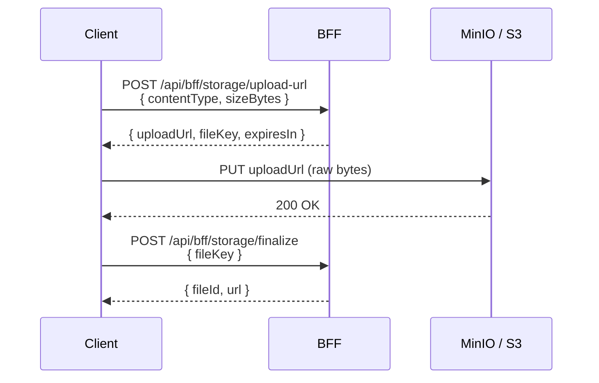

CityOS uses **MinIO** (port 9001) as its default S3-compatible object store. Files are tenant-scoped via path prefix and accessed through signed URLs minted by the BFF.

## Provider matrix

The same BFF endpoints work against multiple providers — MinIO is the default; S3, R2, and GCS are drop-in replacements via environment configuration:

| Provider | Notes |
| --- | --- |
| **MinIO** | Default. Bundled in `docker-compose.full.yml`. |
| **AWS S3** | Production. Set `S3_ENDPOINT=https://s3.amazonaws.com`. |
| **Cloudflare R2** | Zero egress. Set `S3_ENDPOINT=https://<account>.r2.cloudflarestorage.com`. |
| **Google Cloud Storage** | Via S3 compatibility shim. |

## Tenant isolation

Every upload is prefixed with the tenant slug:

```text
s3://<bucket>/{tenantSlug}/{domain}/{yyyy}/{mm}/{dd}/{uuid}.{ext}
```

The BFF rejects requests that try to read or write outside the caller's tenant prefix.

## Signed upload flow



## Request a signed upload URL

```typescript
const { data } = await fetch(`${baseUrl}/api/bff/storage/upload-url`, {
  method: "POST",
  headers: {
    Authorization: `Bearer ${token}`,
    "x-tenant-slug": tenantSlug,
    "Content-Type": "application/json",
  },
  body: JSON.stringify({
    domain: "citizen-complaints",
    contentType: "image/jpeg",
    sizeBytes: 1_500_000,
  }),
}).then((r) => r.json());

// data: { uploadUrl, fileKey, expiresIn }
```

## Upload the bytes

```typescript
await fetch(data.uploadUrl, {
  method: "PUT",
  headers: { "Content-Type": "image/jpeg" },
  body: fileBlob,
});
```

## Finalize

```typescript
const { data: file } = await fetch(`${baseUrl}/api/bff/storage/finalize`, {
  method: "POST",
  headers: { ...headers, "Content-Type": "application/json" },
  body: JSON.stringify({ fileKey: data.fileKey }),
}).then((r) => r.json());

// file: { id, url, contentType, sizeBytes }
```

Use `file.url` as the `evidenceUrls` entry on a citizen complaint, the image on a product, etc.

## File metadata schema

| Field | Type |
| --- | --- |
| `id` | string |
| `url` | string (signed for read, time-limited) |
| `key` | string (S3 key) |
| `contentType` | string |
| `sizeBytes` | number |
| `tenantSlug` | string |
| `domain` | string |
| `uploadedBy` | string (user id) |
| `uploadedAt` | ISO timestamp |

## Limits

| Constraint | Default |
| --- | --- |
| Max file size | 25 MB |
| Max files per request | 5 |
| Allowed types | `image/jpeg`, `image/png`, `image/webp`, `application/pdf`, plus tenant-configured |
| Upload URL TTL | 15 min |
| Read URL TTL | 60 min |

## CDN

Production tenants typically front MinIO / S3 with a CDN. The BFF generates URLs with the CDN host when `STORAGE_CDN_URL` is set.

## Related

- [Environment variables](/configuration/environment-variables) — `S3_*` and `STORAGE_CDN_URL`
- [Citizen guide](/guides/authentication) — complaints attach `evidenceUrls`
- [Webhooks](/configuration/webhooks) — `storage.file.uploaded` event