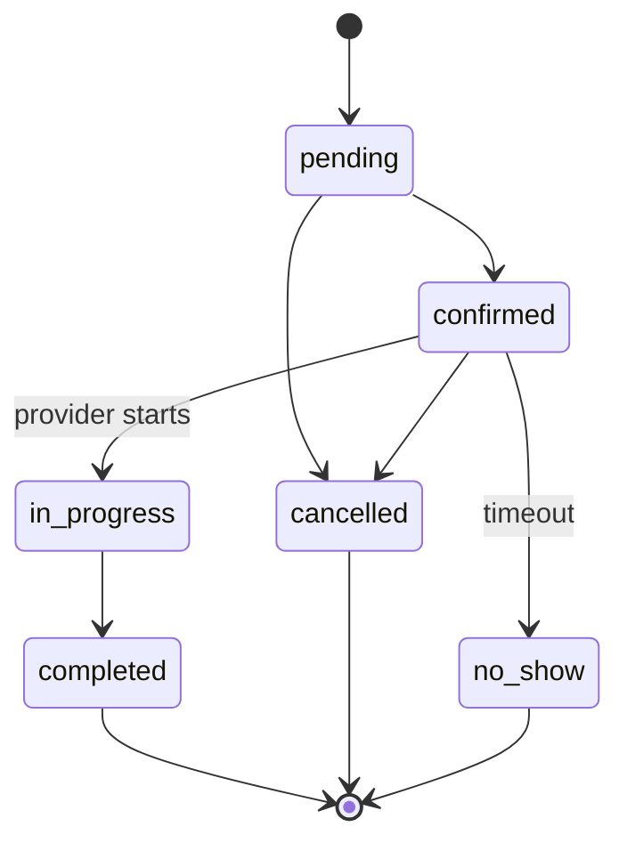

Bookings represent time-slotted service reservations across every CityOS vertical — beauty, healthcare, sports, vehicle service, government appointments, and more. The booking BFF lives at `/api/bff/booking` and enforces ownership: citizens see only their own bookings; admin roles see all tenant bookings.

## Get started

<CardGroup cols={2}>
  <Card title="Guide" icon="book-open" href="/guides/bookings">
  </Card>

  <Card title="API reference" icon="code" href="/api/booking">
  </Card>

  <Card title="SDK client" icon="package" href="/sdk/clients/booking">
  </Card>

  <Card title="Webhooks" icon="webhook" href="/configuration/webhooks">
  </Card>
</CardGroup>

## Booking schema

| Field | Type | Notes |
| --- | --- | --- |
| `id` | uuid | Server-assigned |
| `userId` | string | Owner |
| `tenantSlug` | string | Set from header |
| `serviceType` | string | e.g. `beauty`, `healthcare` |
| `serviceId` | string | Reference to catalog entry |
| `providerId` | string | Provider performing the service |
| `timeSlot.start` / `.end` | ISO 8601 | Required |
| `location.address` | string | Optional |
| `location.lat` / `.lng` | number | -90–90 / -180–180 |
| `attendeeCount` | int | 1–1000 |
| `notes` | string | ≤ 2000 chars |
| `status` | enum | See lifecycle below |

## Status lifecycle



Status values: `pending`, `confirmed`, `cancelled`, `completed`, `no_show`.

## List bookings

`GET /api/bff/booking` supports filtering:

| Query | Description |
| --- | --- |
| `status` | Filter by lifecycle status |
| `from` / `to` | Date range (`YYYY-MM-DD`) |
| `serviceType` | Filter by service type |
| `providerId` | Filter by provider |
| `limit` / `offset` | Pagination (max 100) |

## Create a booking

`POST /api/bff/booking` accepts the full booking payload. Pass `X-Idempotency-Key` to safely retry. Required fields: `serviceType`, `serviceId`, `providerId`, `timeSlot.start`, `timeSlot.end`.

```bash
curl -X POST https://cityos.dakkah.city/api/bff/booking \
  -H "Authorization: Bearer <token>" \
  -H "x-tenant-slug: riyadh-downtown" \
  -H "x-idempotency-key: ik_$(uuidgen)" \
  -H "Content-Type: application/json" \
  -d '{
    "serviceType": "beauty",
    "serviceId": "svc_haircut",
    "providerId": "prov_salon_42",
    "timeSlot": { "start": "2026-06-01T10:00:00Z", "end": "2026-06-01T11:00:00Z" },
    "attendeeCount": 1
  }'
```

## Errors

`BOOKING_LIST_ERROR`, `BOOKING_CREATE_ERROR`, `VALIDATION_ERROR`, `AUTH_ERROR`, `CONFLICT` (overlapping slot). See [Error codes](/resources/error-codes).

## Related

- [Healthcare](/verticals/healthcare) — appointments use the booking primitive
- [Commerce](/verticals/commerce) — `booking` is also one of the 12 offer archetypes