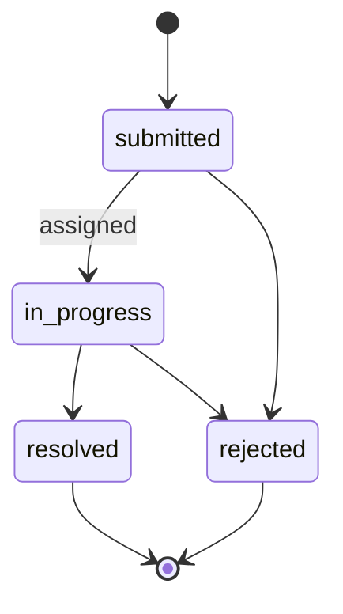

The citizen vertical exposes municipal services — complaints, permits, payments, and transit — through a unified BFF at `/api/bff/citizen/`. It is backed by the `citizen-services` domain package plus integrations to governance, public-safety, transit, and identity domains.

## Get started

<CardGroup cols={2}>
  <Card title="API reference" icon="code" href="/api/citizen">
  </Card>

  <Card title="SDK client" icon="package" href="/sdk/clients/citizen">
  </Card>

  <Card title="Identity & KYC" icon="id-card" href="/integrations/identity">
  </Card>

  <Card title="Governance" icon="landmark" href="/verticals/governance">
  </Card>
</CardGroup>

## Endpoints

| Method | Path | Auth | Purpose |
| --- | --- | --- | --- |
| `GET` | `/api/bff/citizen/services` | Public | List available services |
| `GET` | `/api/bff/citizen/complaints` | Required | List complaints (own / all for admins) |
| `POST` | `/api/bff/citizen/complaints` | Required | Submit a complaint |
| `GET` | `/api/bff/citizen/permits` | Required | List permits |
| `GET` | `/api/bff/citizen/payments` | Required | Payment history |
| `GET` | `/api/bff/citizen/transit` | Required | Transit data |

## Complaint schema

| Field | Notes |
| --- | --- |
| `category` | `infrastructure`, `public-safety`, `sanitation`, `noise`, `illegal-dumping`, `road-damage`, `utilities`, `other` |
| `title` | 5–200 chars |
| `description` | 10–5000 chars |
| `location` | Free-text ≤ 500 chars |
| `coordinates` | `[lat, lng]` |
| `evidenceUrls` | up to 5 URIs |
| `priority` | `low`, `medium`, `high`, `critical` (default `medium`) |
| `status` | `submitted`, `in-progress`, `resolved`, `rejected` |
| `referenceNumber` | Server-assigned, e.g. `CMP-2026-00789` |

## Submit a complaint

```bash
curl -X POST https://cityos.dakkah.city/api/bff/citizen/complaints \
  -H "Authorization: Bearer <token>" \
  -H "x-tenant-slug: riyadh-downtown" \
  -H "Content-Type: application/json" \
  -d '{
    "category": "road-damage",
    "title": "Pothole on King Fahd Road",
    "description": "Large pothole causing traffic issues near exit 12.",
    "priority": "high",
    "coordinates": [24.7136, 46.6753]
  }'
```

Response includes `id` and `referenceNumber` for tracking.

## Complaint lifecycle



## Errors

`COMPLAINTS_LIST_ERROR`, `COMPLAINT_ERROR`, `VALIDATION_ERROR`, `AUTH_ERROR`. See [Error codes](/resources/error-codes).

## Related

- [Governance](/verticals/governance) — permits and regulatory workflows
- [Bookings](/verticals/bookings) — municipal appointment slots
- [Identity & KYC](/integrations/identity) — verify citizen identity via Walt.id