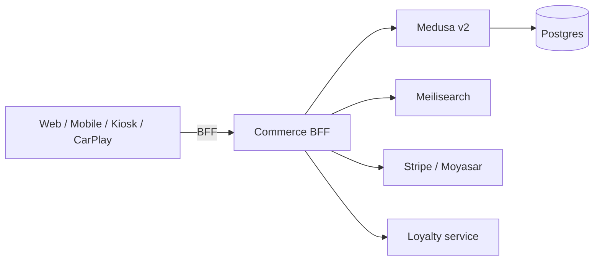

CityOS commerce is powered by **Medusa v2** and surfaces every catalog, cart, and order operation through tenant-scoped BFF routes at `/api/bff/commerce/`. Product listings are cached for 30 seconds, cart operations use a unified action-based endpoint, and order endpoints enforce strict ownership.

## Key concepts

- [Multi-tenancy](/concepts/multi-tenancy) — every cart and order is tenant-scoped through `x-tenant-slug`
- [Surfaces](/concepts/surfaces) — catalog responses adapt to the calling surface
- [SDUI](/concepts/sdui) — storefront layouts are server-driven
- [Domains](/concepts/domains) — commerce is one of 77\+ domain packages

## Get started

<CardGroup cols={2}>
     
</CardGroup>

## Architecture

All commerce requests pass through the standard BFF middleware pipeline: correlation ID → rate limit → JWT/S2S auth → CSRF → RBAC → tenant resolution → NodeContext propagation.

## Endpoints at a glance

| Method | Path | Auth | Purpose |
| --- | --- | --- | --- |
| `GET` | `/api/bff/commerce/products` | Public | List catalog (30s cache) |
| `POST` | `/api/bff/commerce/products` | Admin | Create product |
| `POST` | `/api/bff/commerce/cart` | Optional | Unified cart action endpoint |
| `GET` | `/api/bff/commerce/orders` | Required | List own orders |
| `POST` | `/api/bff/commerce/orders` | Required | Create order (cart-completion flow) |
| `GET` | `/api/bff/commerce/loyalty` | Required | Loyalty balance & tier |
| `POST` | `/api/bff/commerce/loyalty` | Required | Redeem / enroll / history |
| `GET` | `/api/bff/commerce/events-tickets` | Required | List tickets |
| `POST` | `/api/bff/commerce/events-tickets` | Required | Purchase tickets |

Full details in the [Commerce API reference](/api/commerce).

## Cart actions

The `POST /api/bff/commerce/cart` endpoint dispatches on an `action` field:

| Action | Required fields |
| --- | --- |
| `create` | — |
| `retrieve` | `cartId` |
| `addItem` | `cartId`, `variantId`, `quantity` |
| `updateItem` | `cartId`, `lineId`, `quantity` |
| `removeItem` | `cartId`, `lineId` |

## Order creation flow

`POST /api/bff/commerce/orders` is a one-shot cart-completion endpoint that:

1. Creates a cart
2. Adds the provided `items` (each with `variant_id` \+ `quantity`)
3. Attaches `email` and optional `shipping_address`
4. Completes the cart to produce an order

Use `X-Idempotency-Key` to safely retry.

## Commerce modules

CityOS commerce ships extension modules on top of Medusa v2:

<CardGroup cols={2}>
         
</CardGroup>

## Errors

Commerce surfaces these error codes in addition to the standard envelope: `COMMERCE_ERROR`, `VALIDATION_ERROR`, `NOT_FOUND`, `AUTH_ERROR`, `CONFLICT`. See [Error codes](/resources/error-codes) for the full table.

## Related

- [Loyalty](/verticals/loyalty) — accrue points on commerce orders
- [Events](/verticals/events) — ticket purchases run through commerce
- [Search](/integrations/search) — product index in Meilisearch
- [Payments](/integrations/payments) — Stripe, Moyasar, ZATCA e-invoicing
- [Webhooks](/configuration/webhooks)