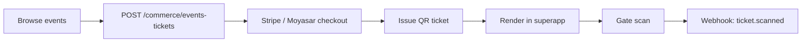

Events and ticketing are backed by **Medusa commerce** via the `events-culture` and `event-ticketing` domain packages. Tickets are purchased like products and tracked per customer, with QR-coded entitlements rendered on mobile.

## Get started

<CardGroup cols={2}>
  <Card title="Guide" icon="book-open" href="/guides/events">
  </Card>

  <Card title="API reference" icon="code" href="/api/events">
  </Card>

  <Card title="SDK client" icon="package" href="/sdk/clients/events">
  </Card>

  <Card title="Commerce" icon="shopping-cart" href="/verticals/commerce">
  </Card>
</CardGroup>

## Endpoints

| Method | Path | Auth | Purpose |
| --- | --- | --- | --- |
| `GET` | `/api/bff/commerce/events-tickets` | Required | List own tickets |
| `POST` | `/api/bff/commerce/events-tickets` | Required | Purchase a ticket |

List query parameters: `customerId`, `eventId`, `status`, `limit`, `offset`.

## Purchase a ticket

```bash
curl -X POST https://cityos.dakkah.city/api/bff/commerce/events-tickets \
  -H "Authorization: Bearer <token>" \
  -H "x-tenant-slug: riyadh-downtown" \
  -H "Content-Type: application/json" \
  -d '{
    "eventId": "evt_riyadh_season_2026",
    "ticketTypeId": "tt_general_admission",
    "quantity": 2
  }'
```

Required: `eventId`, `ticketTypeId`. Optional: `quantity` (default 1).

## Flow



## Errors

`EVENTS_ERROR`, `VALIDATION_ERROR`, `AUTH_ERROR`. See [Error codes](/resources/error-codes).

## Related

- [Commerce](/verticals/commerce) — tickets are Medusa products with the `ticket` archetype
- [Loyalty](/verticals/loyalty) — earn points on ticket purchases
- [Search](/integrations/search) — events are a searchable index