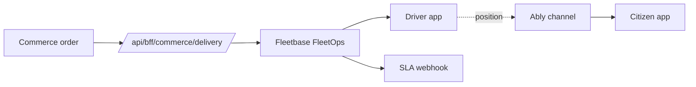
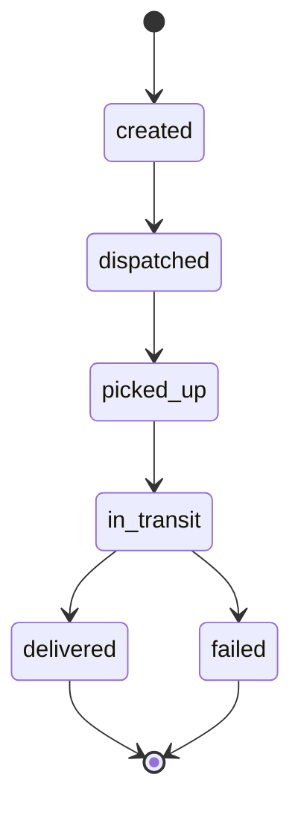

Fleet & logistics in CityOS is powered by **Fleetbase \+ FleetOps** (ports 8000 / 5009) and exposed to clients through the `fleet-logistics` domain package and commerce-delivery BFF routes. Live driver positions stream over Ably; SLA breaches fire webhooks.

## Get started

<CardGroup cols={2}>
  <Card title="Guide" icon="book-open" href="/guides/fleet">
  </Card>

  <Card title="API reference" icon="code" href="/api/fleet">
  </Card>

  <Card title="SDK client" icon="package" href="/sdk/clients/fleet">
  </Card>

  <Card title="Realtime (Ably)" icon="radio" href="/integrations/realtime">
  </Card>
</CardGroup>

## Architecture



## Entities

| Entity | Notes |
| --- | --- |
| **Vehicle** | Owned by tenant, assigned to driver |
| **Driver** | Linked to Keycloak identity |
| **Shipment** | Pickup \+ dropoff with SLA window |
| **Route** | Ordered shipments for one driver |
| **Position** | Streamed lat/lng/heading/speed |

## Ably channels

```text
cityos:{tenantSlug}:fleet:positions          # all drivers
cityos:{tenantSlug}:fleet:positions:{driver} # single driver
cityos:{tenantSlug}:fleet:shipments          # shipment updates
```

Authenticate with the BFF token endpoint — see [Realtime integration](/integrations/realtime).

## Shipment lifecycle



## Webhooks emitted

| Event | When |
| --- | --- |
| `fleet.shipment.dispatched` | Driver assigned |
| `fleet.shipment.picked_up` | Pickup scan |
| `fleet.shipment.delivered` | Drop-off confirmed |
| `fleet.sla.breached` | Window missed |

See [Webhooks](/configuration/webhooks) for signature verification.

## Related

- [Mobile driver app](/apps/overview) — `mobile-driver` Expo app
- [Commerce](/verticals/commerce) — orders trigger dispatch
- [IoT](/verticals/iot) — vehicle telemetry overlap