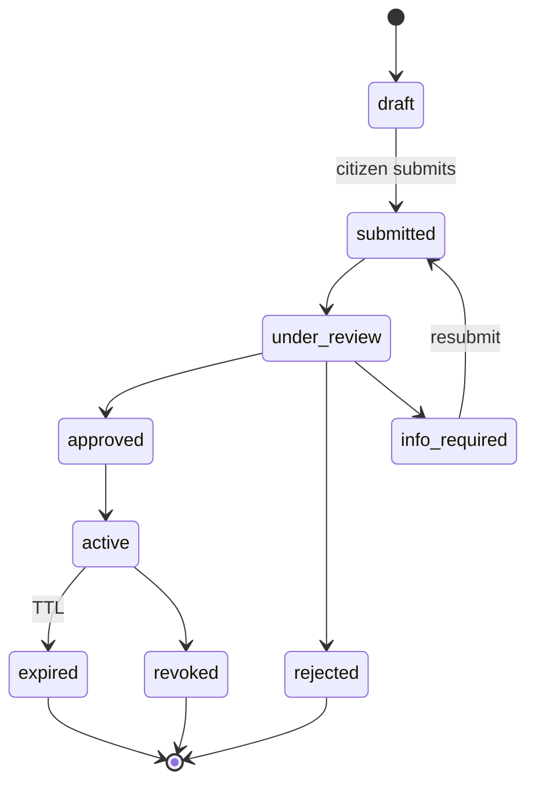

Governance is the meta-vertical that orchestrates municipal authority, policy inheritance across the tenant hierarchy, compliance mandates, and regulatory reporting. It is served by the `governance` domain package and complemented by `permits`, `public-safety`, `registry`, and `legal`.

## Get started

<CardGroup cols={2}>
  <Card title="Citizen services" icon="users" href="/verticals/citizen">
  </Card>

  <Card title="Identity & KYC" icon="id-card" href="/integrations/identity">
  </Card>

  <Card title="Multi-tenancy" icon="layers" href="/concepts/multi-tenancy">
  </Card>

  <Card title="Webhooks" icon="webhook" href="/configuration/webhooks">
  </Card>
</CardGroup>

## What governance owns

- **Policy inheritance** — compliance rules propagate from `MASTER` → `GLOBAL` → `REGIONAL` → `COUNTRY` → `CITY` and can be overridden at any tier
- **Permits** — issuance, renewal, inspection workflows
- **Regulator roles** — inspector, auditor, official mapped to Keycloak groups
- **Compliance mandates** — ZATCA e-invoicing, GDPR right-to-be-forgotten, NCA/NDMO (healthcare)
- **Regulatory reporting** — automated submissions per jurisdiction

## Permit lifecycle

## Related routes

Permits are listed via `GET /api/bff/citizen/permits`. Field inspections are typically built on top of [Bookings](/verticals/bookings) with a `governance` service type.

## Compliance integrations

| Mandate | How CityOS handles it |
| --- | --- |
| **ZATCA e-invoicing** | Stripe/Moyasar integration emits compliant invoices for Saudi tenants |
| **GDPR / NDMO** | Right-to-be-forgotten workflow via the `identity-auth` domain |
| **Walt.id Verifiable Credentials** | KYC for high-trust permits |

## Related

- [Citizen services](/verticals/citizen)
- [Multi-tenancy](/concepts/multi-tenancy) — policy inheritance model
- [Mobile inspector & government apps](/apps/overview)