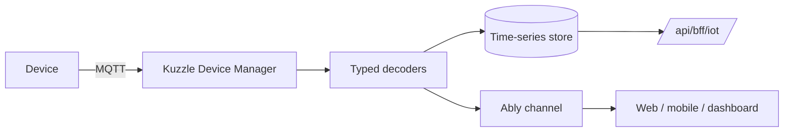

IoT in CityOS is powered by **Kuzzle Device Manager** (port 7512). MQTT-published sensor payloads are normalized by typed decoders for 8 device families and surfaced through REST endpoints plus live Ably channels.

## Get started

<CardGroup cols={2}>
  <Card title="API reference" icon="code" href="/api/iot">
  </Card>

  <Card title="SDK client" icon="package" href="/sdk/clients/iot">
  </Card>

  <Card title="Realtime (Ably)" icon="radio" href="/integrations/realtime">
  </Card>
</CardGroup>

## Sensor families

| Type | Key measurements |
| --- | --- |
| `AirQuality` | aqi, pm25, pm10, no2, co2, temperature, humidity |
| `SmartBin` | fillLevel, temperature, battery |
| `WaterQuality` | ph, turbidity, dissolvedO2, temperature, conductivity |
| `ColdStorage` | temperature, humidity, doorOpen, batteryLevel |
| `SmartMeter` | consumption, peakDemand, voltage |
| `TrafficFlow` | vehicleCount, avgSpeed, congestion |
| `ParkingOccupancy` | occupied, zone, spotType |
| `IrrigationSensor` | soilMoisture, soilTemp, soilEC |

Full measurement reference in the [IoT guide](/guides/iot-telemetry).

## Architecture



## Ably channels

```text
cityos:{tenantSlug}:iot:air-quality
cityos:{tenantSlug}:iot:smart-bin
cityos:{tenantSlug}:iot:water-quality
cityos:{tenantSlug}:iot:cold-storage
cityos:{tenantSlug}:iot:smart-meter
cityos:{tenantSlug}:iot:traffic-flow
cityos:{tenantSlug}:iot:parking
cityos:{tenantSlug}:iot:irrigation
```

## Capability gating

Before integrating, verify `iotEnabled` and `ablyEnabled`:

```typescript
const { data } = await tenant.getCapabilities();
if (!data.iotEnabled) return;
if (!data.ablyEnabled) console.warn("Live streaming unavailable");
```

## Related

- [Fleet](/verticals/fleet) — vehicle telemetry shares the streaming pattern
- [Realtime](/integrations/realtime) — Ably auth token endpoint
- [Smart City dashboard apps](/apps/overview)